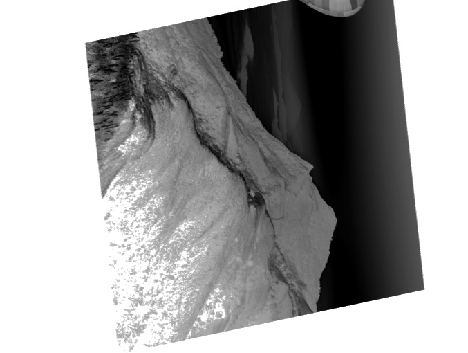

# 📸 Como Usar o Aplicativo
O aplicativo oferece uma interface simples e intuitiva para captura e edição de imagens. Siga os passos abaixo para começar:
## 1. Captura ou Upload da Imagem
- Ao iniciar o aplicativo, o usuário pode:
- Tirar uma foto utilizando a webcam.
- Fazer o upload de uma imagem existente a partir do seu dispositivo.
## 2. Edição da Imagem
- Após selecionar a imagem, uma nova tela será exibida com os controles de edição posicionados à esquerda.
- Os seguintes ajustes estão disponíveis:
- 🔄 Rotação
- 🔍 Escala
- 🪞 Cisalhamento
- 🌞 Brilho
- 🌗 Contraste
- 🎚️ Intensidade
- ⚫ Negativo
- Para aplicar as modificações, o usuário deve clicar no botão Aplicar.
## 3. Visualização e Download
- A imagem original será exibida no topo da tela.
- Abaixo dela, será mostrada a imagem modificada com as alterações aplicadas.
- O usuário pode fazer o download da imagem alterada clicando no botão Download.
## 4. Edição Contínua
- Os controles de edição permanecem disponíveis em tempo real.
- O usuário pode ajustar os valores quantas vezes quiser e reaplicar as modificações a qualquer momento.

# 🖼️ Exmeplos de Imagens Editadas




# Como Executar Localmente

## 🚀 Como Executar o Aplicativo Streamlit com Astral.sh uv

Este projeto utiliza o framework Streamlit para construir aplicações web interativas em Python. O gerenciamento de ambiente é feito com o `uv`, oferecido pelo [Astral.sh](https://astral.sh). Siga os passos abaixo para executar o aplicativo localmente:

### 🛠️ Pré-requisitos

- [Python 3.13](https://www.python.org/downloads/)
- [uv (via Astral.sh)](https://docs.astral.sh/uv/getting-started/installation/)
- Git instalado

### 📦 Instalação

1. Clone este repositório:
    ```bash
    git clone https://github.com/seu-usuario/seu-projeto.git
    cd seu-projeto
    ```

2. Sincronize o ambiente com as dependências do projeto:
    ```bash
    uv sync
    ```

### 🧪 Execução do Streamlit

- Rode o servidor Streamlit:
    ```bash
    uv run streamlit run app.py
    ```

## 🚀 Como Executar o Aplicativo Streamlit

Este projeto utiliza [Streamlit](https://streamlit.io/) para criar uma interface web interativa com Python. Siga os passos abaixo para executar o aplicativo localmente:

### 🛠️ Pré-requisitos

Certifique-se de ter instalado:

- Python 3.13
- pip (gerenciador de pacotes do Python)
- Virtualenv (opcional, mas recomendado)

### 📦 Instalação

1. Clone este repositório:
    ```bash
    git clone https://github.com/seu-usuario/seu-projeto.git
    cd seu-projeto
    ```

2. (Opcional) Crie e ative um ambiente virtual:
    ```bash
    python -m venv venv
    source venv/bin/activate  # no Linux/macOS
    .\venv\Scripts\activate    # no Windows
    ```

3. Instale as dependências:
    ```bash
    pip install -r requirements.txt
    ```

### ▶️ Executando o aplicativo:
- Execute o aplicativo com Streamlit:
    ```bash
    streamlit run app.py
    ```
- O Streamlit abrirá automaticamente uma aba no seu navegador com a interface do app. Caso contrário, acesse o link exibido no terminal (geralmente http://localhost:8501).
